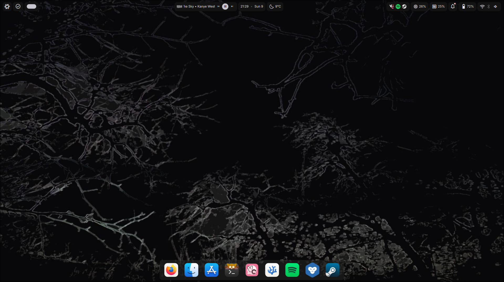

# My NixOS Configs

I'm new to NixOS and I'm sharing my personal configuration files for my desktop and laptop setups.  

## What’s Included

- Desktop and laptop configurations  
- KDE Plasma setup  
- Virtualization tools (QEMU, libvirt, Looking Glass)
- GPU passtrough

## Notes

- These configs are my personal setup and may require adjustments for other hardware.  
- I use `$user` placeholders for my username.  

## Hyprland Setup

I've recently switched to Hyprland using **QuickShell** and **Dank Material Shell**.  
This gives me a fast, minimal, and visually appealing Wayland environment tailored to my workflow.

### Features
- Integrated widgets and aesthetic themes from Dank Material Shell  

### Screenshot
 

### Notes
- Configs are stored in `$HOME/.config/home-manager/`  (for the laptop)
- Some settings are hardware-specific (like GPU passthrough and monitor layouts)  
- Feel free to adapt keybindings, themes, and scripts to your own workflow

## Future Plans

- I might create and share my own Hyprland setup in the future.  

Feel free to look around, adapt, or suggest improvements.  

---

*Disclaimer:* Use at your own risk. These configs are tailored to my hardware and workflow.
